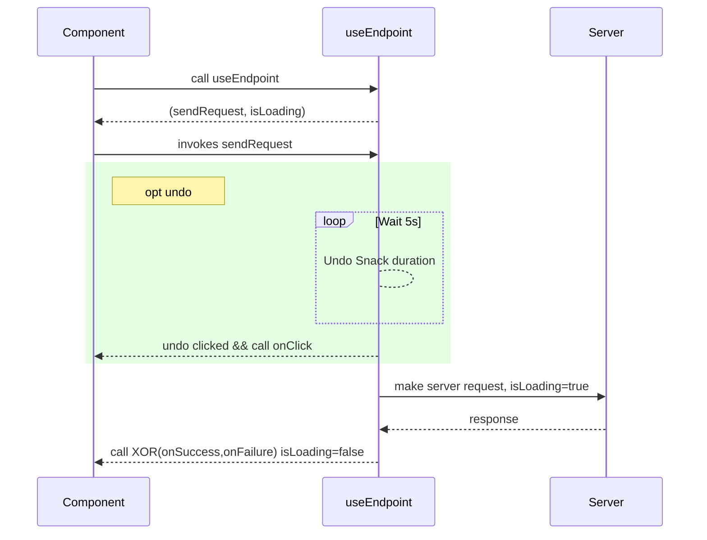

# Use Endpoint
## Overview
This component is used when a request needs to be made to the server. An optional undo parameter allows users to undo a request by clicking on a snack.

# Index
- [Functions](#f)
- [Examples](#e)

# <a name="f"></a>Functions
- `useEndpoint(request, options)`
    * <b>option undo</b>: displays a snack with an undo button for the user to stop a request from being sent. If the button is pressed, the request is cancelled, otherwise it is sent normally.
    * <b>calls</b>: `onSuccess` or `onFailure` appropriately, `onUndo` if the user presses the button

# <a name="e"></a>Examples
- Normal Request
```js
const builtRequest = React.useCallback(() => API.register(form), [form]);

const [sendRequest, isLoading] = useEndpoint(builtRequest, {
    onSuccess: () => {
        snack('Success');
        onSuccess();
    },
    onFailure,
});
```
- Undoable Request
```js
const undo = { message: 'click to undo', onClick: () => {
    snack('You clicked undo');
}};

const builtRequest = React.useCallback(() => API.register(form), [form]);

const [sendRequest, isLoading] = useEndpoint(builtRequest, {
    onSuccess: () => {
        snack('Success');
        onSuccess();
    },
    onFailure, undo,
});
```
1. Build and pass the `undo` argument when calling `useEndpoint` with the `message` to show and `onClick` function to execute
2. If the user clicks the undo button, `useEndpoint` calls `onClick` and the request is cancelled. Otherwise, after a 5 second delay, it makes the request and returns `onSuccess` 
3. Handle `onSuccess`

