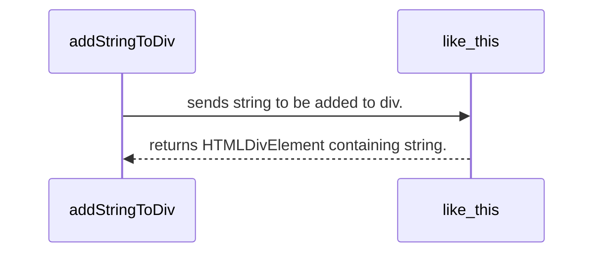

# Title of component
## Overview
- inspired by golang documentation but modified for a more funcitonal approach

# Index
- [Variables](#v)
- [Functions](#f)
- [Examples](#e)

# <a name="v"></a>Variables
- name: type
    * description

# <a name="f"></a>Functions
- function signature
- `function like_this(string, HTMLDivElement)`
    * <b>description</b>: renders string into HTMLDivElement 
    * <b>return (if returns)</b>: HTMLDivElement

# <a name="e"></a>Examples
- Lets say we have the following code
```
function addStringToDiv() {
    const toAdd = "going to be added";
    var div = document.createElement("div");

    const divToAdd = like_this(toAdd,div);

    return divToAdd;
}
```
