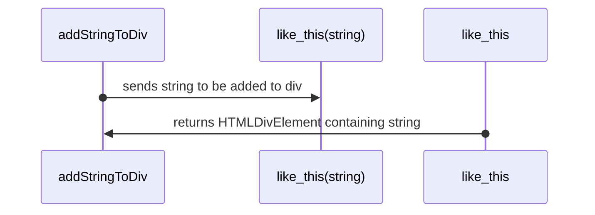

# Title of component
## Overview
- inspired by golang documentation but modified for a more funcitonal approach

# Index
- [Variables](#v)
- [Functions](#f)
- [Examples](#e)

# <a name="v"></a>Variables
| name  | type   | description  |
|-------|------  |------------- |
| str   | string | name of user | 

# <a name="f"></a>Functions
| signature  | return type   | description  |
|-------|------  |------------- |
| func1(string)   | string | returns name of user in upper case |

# <a name="e"></a>Examples
- Lets say we have the following code
```
function addStringToDiv() {
    const toAdd = "going to be added";
    var div = document.createElement("div");

    const divToAdd = like_this(toAdd,div);
    
    return divToAdd;
}
```
