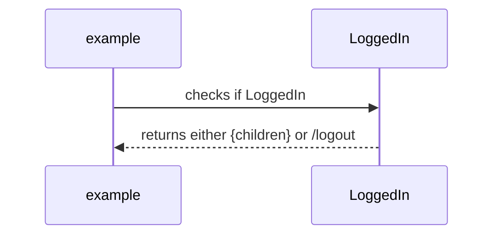

# LoggedIn
## Overview
- redirects to login page if the user is not logged in
- if trying to access something with login privileges, we redirect to `/logout`

# Index
- [Variables](#v)
- [Functions](#f)
- [Examples](#e)

# <a name="v"></a>Variables
- Props
    * children: JSX.Element or JSX.Element[]

# <a name="f"></a>Functions
- `export default function LoggedIn({ children }: Props)`
    * <b>description</b>: redirects to the login page if the user is not logged in 
    * <b>return</b>: \<Redirect/\> to `/logout`
        * or returns `<>{children}</>` 

# <a name="e"></a>Examples
```JSX
function example() {
...
const children = <h1>LoggedIn</h1>;
...
return (
    <Route path='/app'>
        <LoggedIn
            children={children}
        />
    </Route>
);
}
```
